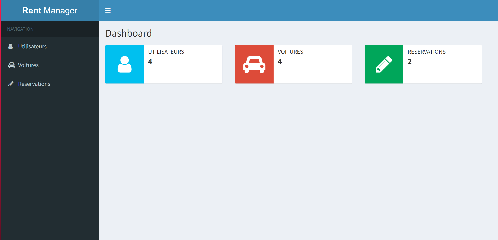

# RentManager - Langage JAVA

## Auteur
Béatrice GARCIA CEGARRA, PSFGE4 MIN1

[beatrice.garciacegarra@epfedu.fr](mailto:beatrice.garciacegarra@epfedu.fr)

## Contexte
Projet final en cours de Langage JAVA, nommé RentManager, au 2è semestre de 4è année, en majeure Informatique et Numérique, à l'EPF école d'ingénieurs.

## Description

Application de gestion de location de véhicules

### Base de données

### Classes JAVA

Il existe 3 instances : **_Client_**, **_Véhicule_** et **_Réservation_**.
Chacune possède un **service**, une **DAO** et un **modèle**.
Les DAO et les services sont respectivement régis par des classes d'exception.

### Application web

La page web reliée au serveur possède une page principale ou Home Page.
Les élémenbts sont un header et une scrollbar.
La scrollbar donne accès aux pages respectives des clients, voitures et réservations ffichant par défaut la liste des objets existants concernés.

Dans les pages, il est possible de créer un nouvel objet, ou encore de supprimer, modifier ou visualiser en détails un objet existant à l'aide de 3 boutons.

### Servlet et jsp

Chacune des 4 actions (Créer, modifier, visualiser, supprimer) pour chacune des 3 classes d'objets est liée à un unique jsp et un unique servlet.
La page d'accueil possède également son propre jsp et Servlet.

### Contraintes et Tests

Les contraintes suivantes s'appliquent à la manipulation de l'application :

- un client n'ayant pas 18ans ne peut pas être créé
- un client ayant une adresse mail déjà prise ne peut pas être créé
- le nom et le prénom d'un client doivent faire au moins 3 caractères
- une voiture ne peux pas être réservé 2 fois le même jour
- une voiture ne peux pas être réservé plus de 7 jours de suite par le même utilisateur
- une voiture ne peux pas être réservé 30 jours de suite sans pause
- si un client ou un véhicule est supprimé, alors il faut supprimer les réservations associées
- une voiture doit avoir un modèle et un constructeur, son nombre de place doit être compris entre 2 et 9

